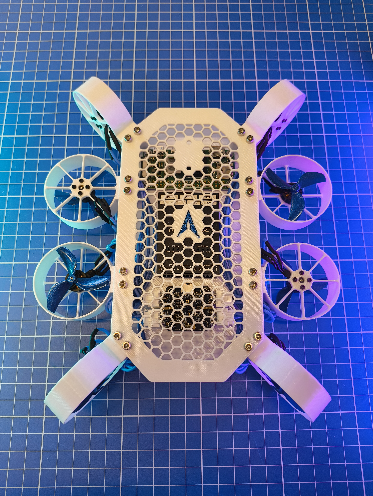

# Vision Zero-G

**A compact camera-drone prototype for movement inside spacecraft cabins.**

I designed Vision Zero-G in Fusion 360 to explore a camera platform that could move and orient itself in microgravity. The physical prototype combines a printed frame, eight electric ducted fan modules, a Pixhawk flight controller and a Raspberry Pi companion computer.

The goal is to film crew activities without a fixed camera mount or continuous manual positioning. Autonomous navigation and tracking are planned capabilities. This repository documents the mechanical design, assembled hardware and early control experiments.

  

## Explore the project

| | |
| --- | --- |
| [Mechanical design and CAD](docs/mechanical-design.md) | Frame, duct arrangement, electronics packaging and revision history |
| [How it is intended to work](docs/system-design.md) | Propulsion, control architecture and camera-navigation concept |
| [Hardware choices](docs/hardware.md) | Main components and development tradeoffs |
| [Control experiments](docs/software.md) | Original Arduino and Pixhawk-oriented sketches |
| [Prototype gallery](docs/gallery.md) | Five photographs of the assembled prototype |
| [Development](docs/development.md) | Work completed and the next engineering stages |

## CAD and drawing

- [Download the v0.5.1 STEP assembly](hardware/cad/EXRI_Vision_Zero-G_v0.5.1.step) · approximately 40.6 MB
- [View the v0.5.2 engineering drawing](hardware/drawings/EXS_Vision_Zero-G_v0.5.2_Drawing_v10.pdf)

The STEP contains the mechanical and electronics assembly. The drawing describes a later revision and is labelled separately. The STEP is a geometry exchange file; it does not contain the Fusion feature timeline.

## Development scope

The work presented here covers CAD design, physical prototype assembly, component integration and early control-code experiments. The sketches are developmental source, not deployable flight firmware. Autonomous navigation, microgravity manoeuvring and spacecraft qualification remain development work.

**Design: Kian Konrad Tajbakhsh · Exlumina**

See [rights and attribution](NOTICE.md) for the scope of the repository materials.
