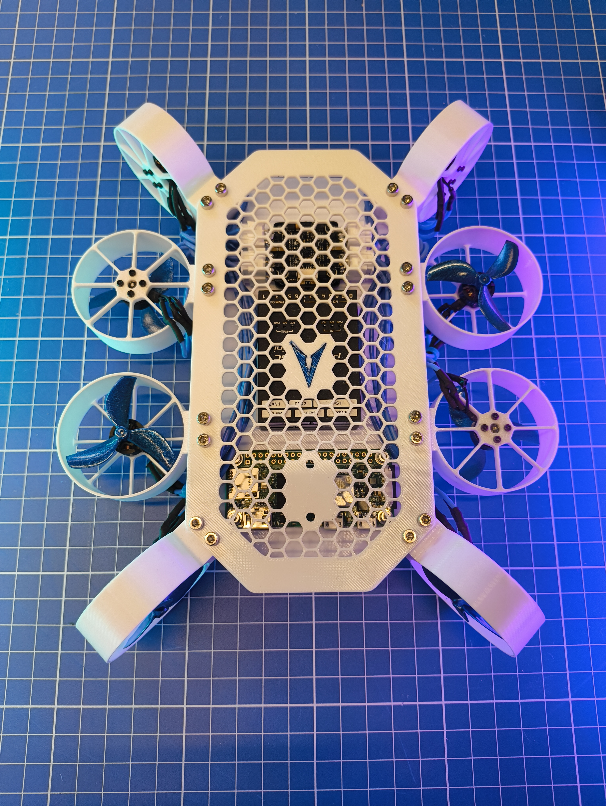
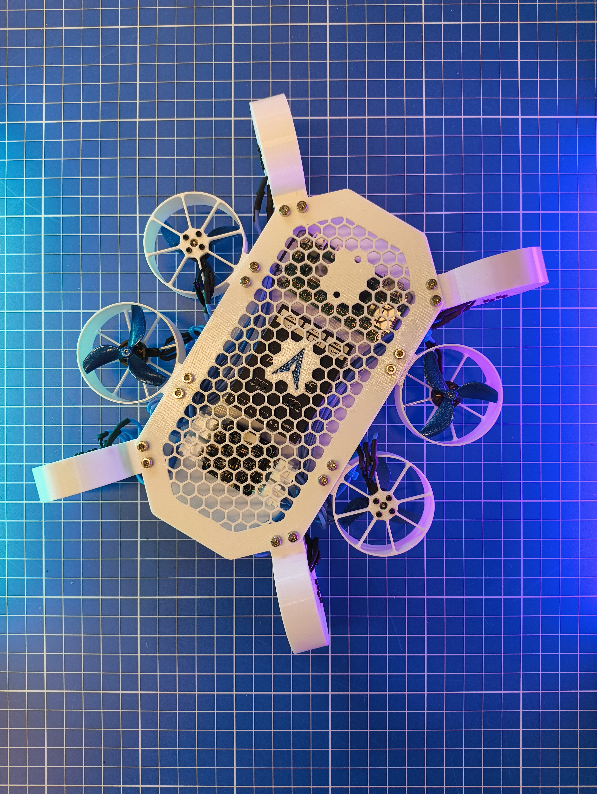
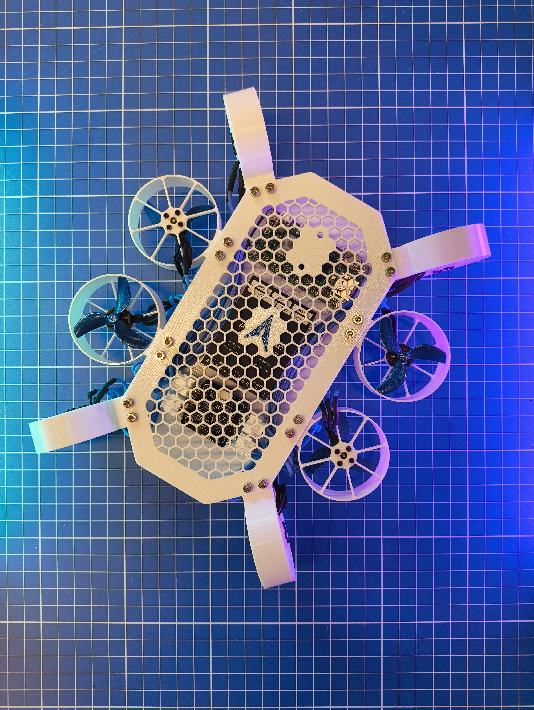
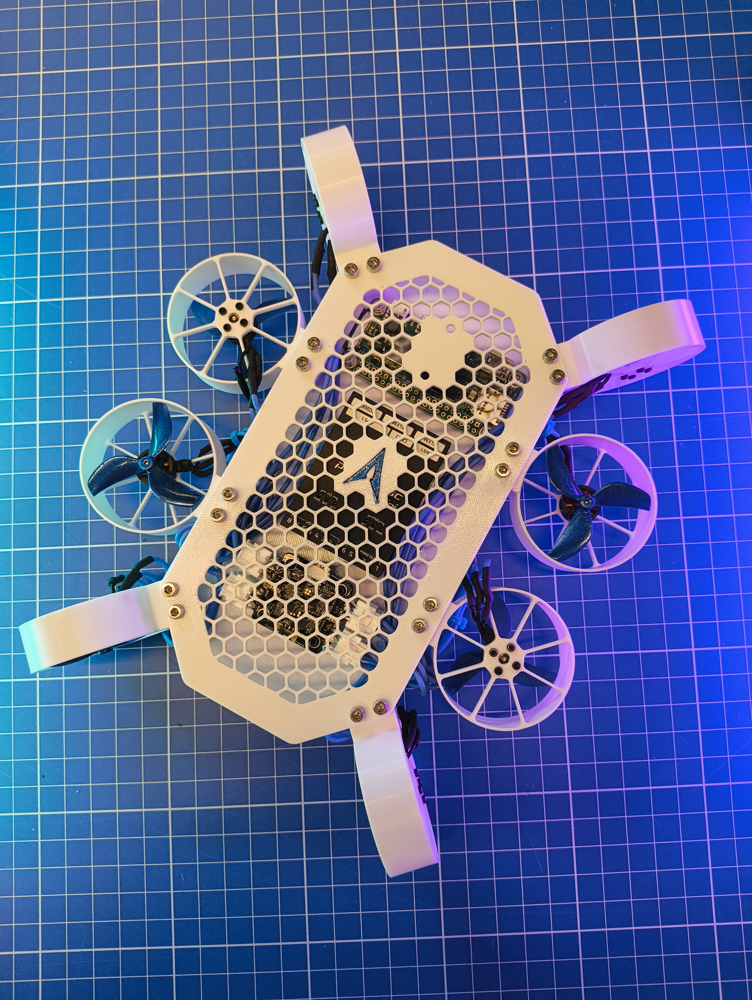

# Prototype photographs

[Overview](../README.md) · [Mechanical design](mechanical-design.md)

The assembled prototype on 10 July 2025: white printed cover, honeycomb openings, eight duct modules, blue propellers and electronics beneath the cover. Select a photograph to open the full-size image.

<table>
  <tr>
    <td align="center"> Top view</td>
    <td align="center"> Electronics beneath the cover</td>
  </tr>
  <tr>
    <td align="center"> Frame and duct layout</td>
    <td align="center"> Perimeter fan modules</td>
  </tr>
  <tr>
    <td align="center"> Cover, fasteners and wiring</td>
    <td></td>
  </tr>
</table>
