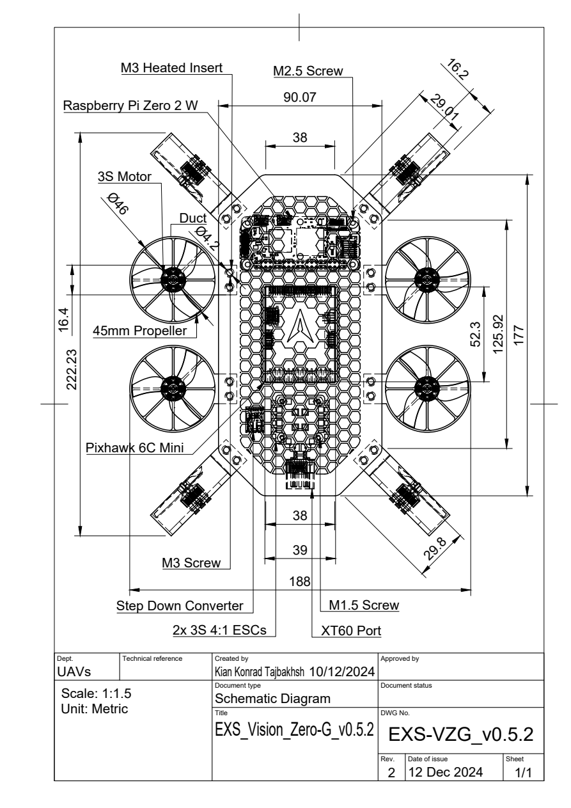

# Mechanical design

[Overview](../README.md) · [Hardware](hardware.md) · [Photographs](gallery.md)

I developed the frame and overall assembly in Fusion 360 around eight individually mounted ducted-fan modules. Two central plates housed the electronics. The fan modules sat around the perimeter, with four axes perpendicular to the plates and four angled within the frame plane.

The physical prototype used a white printed frame, a honeycomb cover, blue propellers and routed wiring. Screws and inserts attached the cover and fan modules.

## CAD assembly

[Open the v0.5.1 STEP file](../hardware/cad/EXRI_Vision_Zero-G_v0.5.1.step)

The assembly includes eight EDF modules, the central plates, Pixhawk 6C Mini and Raspberry Pi Zero 2 W representations, two ESCs, a step-down converter, an XT60 connector and mounting spacers. Commercial component models provided packaging references within the overall design.

Import the STEP into CAD software that supports STEP assemblies. It contains geometry and component placement; the original Fusion feature timeline is not included. This is a development model, not a qualified manufacturing package.

## Later engineering drawing

[Open the v0.5.2 drawing PDF](../hardware/drawings/EXS_Vision_Zero-G_v0.5.2_Drawing_v10.pdf)

   
  v0.5.2 engineering drawing. Open the PDF for full-size annotations.

| Drawing annotation | Value |
| --- | --- |
| Duct diameter | 46 mm |
| Propeller diameter | 45 mm |
| Horizontal plan-view dimension | 188 mm |
| Vertical plan-view dimension | 222.23 mm |
| Title-block revision | 2 |
| Issue date | 12 December 2024 |

These annotations belong to v0.5.2. They are separate from the v0.5.1 STEP and are not measurements of the photographed prototype. The filename's `Drawing_v10` suffix is retained from the original export; it differs from the title-block revision.
