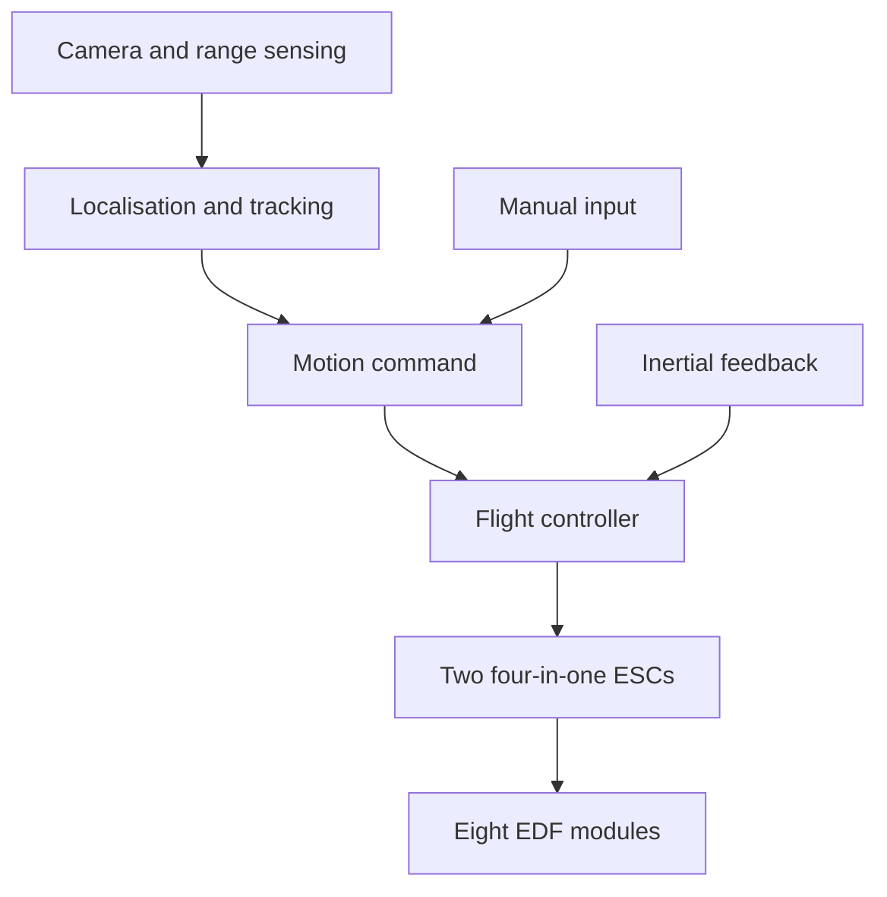

# System concept

[Overview](../README.md) · [Mechanical design](mechanical-design.md) · [Control experiments](software.md)

Vision Zero-G was conceived as a mobile camera platform for a pressurised spacecraft cabin. Its fans would generate thrust by moving the surrounding air. The concept depended on an atmosphere and targeted the interior of a spacecraft.

## Motion in six degrees of freedom

The intended motion combined translation along three axes with rotation about three axes. Four fan axes were perpendicular to the central plates; four more were angled within the frame plane. The controller would combine their forces to change position and orientation.

The design referenced ArduSub's eight-thruster `vectored6dof` arrangement. [ArduSub's frame documentation](https://ardupilot.org/sub/docs/sub-frames.html) describes that ROV layout. Applying it to this air-propelled prototype required a separate actuator model, motor allocation and control tuning, including assessment of reverse-thrust authority.

## Intended control architecture

The Raspberry Pi was intended to handle higher-level camera and navigation processing, with the Pixhawk handling vehicle feedback and motor control. The two archived sketches explored parts of the controller; they did not implement this integrated architecture.

## Camera functions

The goal was to maintain a useful viewpoint while filming crew activities. Visual mapping, range sensing, subject tracking and manual control formed the intended feature set. Camera and range-sensor integration, localisation and the command interface remained unfinished when the project ended.

## Power architecture

The design used a 3S battery architecture, an XT60 connection, two four-in-one ESCs and a step-down converter. Endurance, peak current and thermal performance are not specified by this archive.
