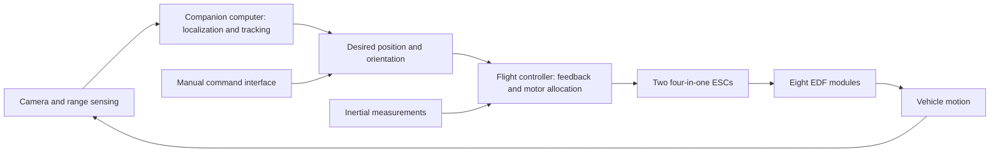

# How Vision Zero-G is intended to work

Vision Zero-G is intended for a pressurized spacecraft cabin. Its fans move the surrounding air to generate thrust. The design is for an interior microgravity environment; air propulsion requires an atmosphere.

## Motion

The target is six degrees of freedom: movement along three axes and rotation about three axes. Eight fan modules surround the central enclosure, with four perpendicular to the plates and four angled within the frame plane.

Changing the combination of fan forces is intended to produce either translation or rotation. This requires a controller that accounts for each fan's position, direction and response. A layout alone does not determine whether a particular motor and propeller combination can produce every required command, especially where reverse thrust is needed.

The historical architecture references ArduSub's eight-thruster `vectored6dof` arrangement. [ArduSub's frame documentation](https://ardupilot.org/sub/docs/sub-frames.html) describes that ROV layout. Adapting the idea to this air-propelled vehicle requires its own actuator model and control tuning.

## Planned control architecture

This diagram describes the intended integrated system. The archived sketches cover early control experiments; they do not implement this complete loop.

## Camera and navigation

The camera-platform concept combines filming with a mobile viewpoint. The development plan calls for onboard visual mapping, range sensing, subject tracking and manual control. These functions would let the platform maintain a useful camera position while responding to movement in the cabin.

A Pixhawk controller and Raspberry Pi Zero 2 W provide the intended division between low-level vehicle control and higher-level processing. Camera selection, range-sensor integration, localization and the command interface still need a complete software implementation and validation.

## Power

The design uses a 3S battery architecture, an XT60 connection, two four-in-one ESCs and a step-down converter for the electronics. Power distribution, peak current, thermal behaviour and endurance need to be characterised on the assembled hardware.

[Back to the project](../README.md)
